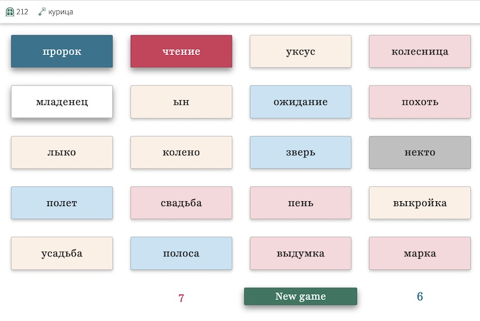

# Codenames

[](https://app.netlify.com/sites/friday-game/deploys)

A [Vue3](https://vuejs.org/) + [Ably](https://ably.com/) implementation of [Codenames](https://en.wikipedia.org/wiki/Codenames_\(board_game\)) board game.

## Motivation

Just a quick hobby project for me and my friends.



## Building

Call `git clone` and then `npm install` to get the deps. The build tool is [Vite](https://vitejs.dev/), but before building the app it needs a couple of env var to be added in `.env`.

For multiplayer support the game needs an API key to talk to Ably servers and been a web app that means that the key will be exposed through JS source code. One way to go about it would be to use Netlify or Cloudflare functions to initialize the Ably client, but I went with another method and encrypted the key with AES-CBC, so it's all static and there is a shared secret between players that allows to decrypt the key on login.

To get the encryption's ciphertext and secret's checksum for a build set API key in `.env` file as `ABLY_API_KEY` and secret as `SECRET` and then run `npm run encrypt`.

```bash
$ npm run encrypt

> codenames@0.1.0 encrypt
> node ./assets/encrypt.mjs

Because there is no global crypto property in this context, cryptographically unsafe Math.random() is used
VITE_KEY_CHECKSUM=...
VITE_KEY_CIPHERTEXT=...
```

Copy and paste the last two lines into `.env` file and run `npm run build`. Vite stores all the compiled code in `/dist` folder.

## Deployment

Pretty easy deployment to [Netlify](https://app.netlify.com), to be honest. Start a new site, link the repo, agree to all correctly guessed commands, add env vars and wait for deployment to finish. Then, optionally, change site name to something more catchy, discovering in the process that all the catchy names have already been taken.

The only gotcha is that it seems that the first deployment kicks in before env vars got set, so they haven't been picked up by Vite. However, no changes re-deployment did the trick.

All in all Netlify, as always, is a pleasure to work with, hugely intuitive and overall just amazing.

## Development

Run `npm run dev` and open the app on http://localhost:5173 It actually runs on `0.0.0.0`, to test on iPad, and it runs against real Ably account, because


There are not many tests, it's a hobby project, after all.

## License

[MIT](https://github.com/eiri/codenames/blob/master/LICENSE)
