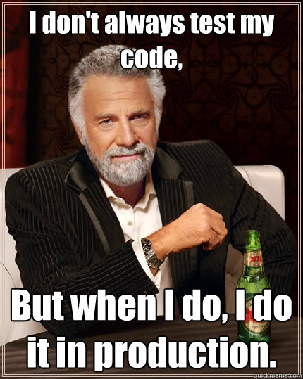

# Codenames

A [Vue3](https://vuejs.org/) + [Ably](https://ably.com/) implementation of [Codenames](https://en.wikipedia.org/wiki/Codenames_\(board_game\)) board game.

## Motivation

Just a quick hobby project for me and my friends.

## Building

Call `git clone` and then `npm install` to get the deps. The build tool is [Vite](https://vitejs.dev/), but before building the app it needs a couple of env var to be added in `.env`.

For multiplayer support the game needs an API key to talk to Ably servers and been a web app that means that the key will be exposed through js source code. One way to go about it would be to use Netlify or Cloudfare functions to init the Ably client, but I went with another method and encrypting the key with AES-CBC, so there is a shared secret between players that allows to decrypt the key on login.

To get the encryption's ciphertext and secret's checksum set API key in `.env` file as `ABLY_API_KEY` and secret as `SECRET`, then run `npm run encrypt`.

```bash
$ npm run encrypt

> codenames@0.1.0 encrypt
> node ./assets/encrypt.mjs

Because there is no global crypto property in this context, cryptographically unsafe Math.random() is used
VITE_KEY_CHECKSUM=...
VITE_KEY_CIPHERTEXT=...
```

Copy and paste the last two lines into `.env` file and run `npm run build`. Vite will place all compiled code in `/dist` folder.

## Deployment

TBD

## Development

Run `npm run dev` and open the app http://localhost:5173 It's actually runs on `0.0.0.0`, to test on iPad and it runs against real Ably account, because



There are no tests whatsoever, no Vitest, no Cypress, nothing, sorry. It's a hobby project from someone who doesn't do frontend (or much node really) and I don't have desire to learn another testing framework in unknown language.

## License

[MIT](https://github.com/eiri/codenames/blob/master/LICENSE)
